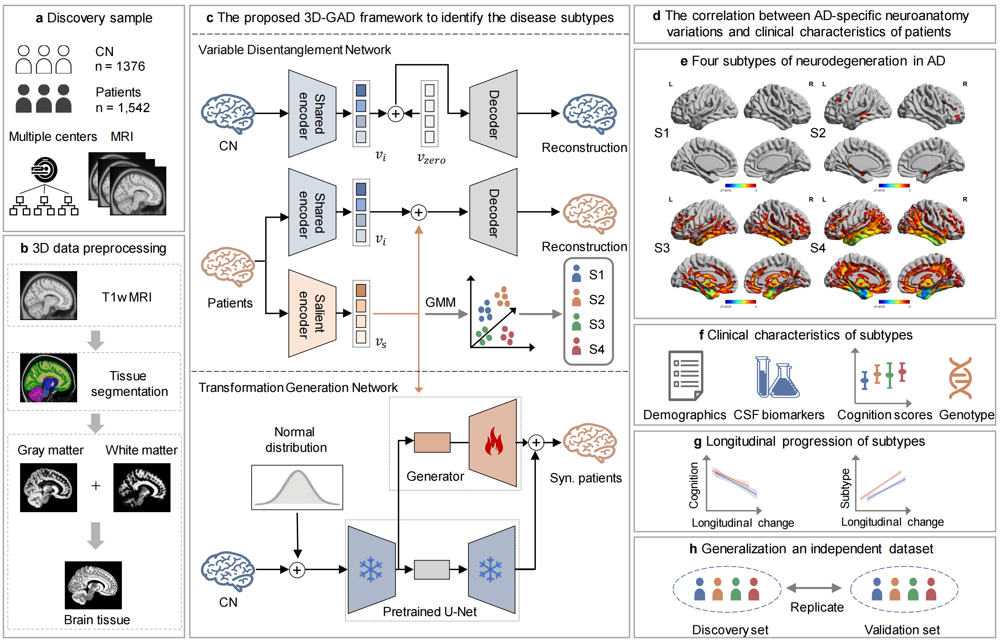
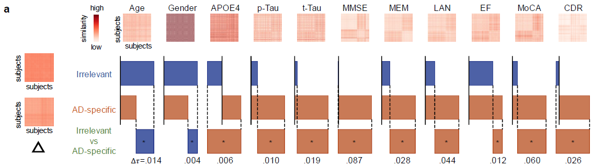

<div align="center">


# 3D Generative Model Reveals the Neuroanatomical Heterogeneity in Alzheimer's Disease with Subtypes


<a href="https://pytorch.org/get-started/locally/"></a>
<a href="https://pytorchlightning.ai/"></a>
<a href="https://hydra.cc/"></a>
<a href="https://github.com/ashleve/lightning-hydra-template"></a><br>

</div>

## Description

This repo is the official implementation of our work `3D Generative Model Reveals the Neuroanatomical Heterogeneity in Alzheimer's Disease with Subtypes`


By comparing the data differences between healthy individuals and patients, we obtained disease-specific representations while preserving shared features unrelated to the disease. Through correlation verification, the effectiveness of our proposed method was confirmed.


## Installation

#### Pip

```bash
# clone project
git clone https://github.com/SandyAlexa/3D-GAD.git
cd 3D-GAD

# [OPTIONAL] create conda environment
conda create -n 3d_gad python=3.11.0
conda activate 3d_gad

# install pytorch according to instructions
# https://pytorch.org/get-started/

# install requirements
pip install -r requirements.txt
```

#### Conda

```bash
# clone project
git clone https://github.com/SandyAlexa/3D-GAD.git
cd 3D-GAD

# create conda environment and install dependencies
conda env create -f environment.yaml -n 3d_gad

# activate conda environment
conda activate 3d_gad
```
## Data 

The data used in this study includes three public datasets. To access these datasets, you will need to register and submit a request on their respective websites.
1. ADNI: www.adni-info.org
2. AIBL: [aibl.csiro.au/adni/index.html](https://aibl.csiro.au/adni/index.html)
3. OASIS-3: www.oasis-brains.org/#access
   
After obtaining the data, you will need to preprocess the datasets according to the methods described in our paper.

## How to run

### First STEP 
Train regular diffusion using control normal data.

```bash
sh ./scripts/train_contrastive_diffusion_regular.sh
```

### Second STEP 

Train contrastive diffusion using control normal and patient data.

```bash
sh ./scripts/train_contrastive_diffusion.sh
```

